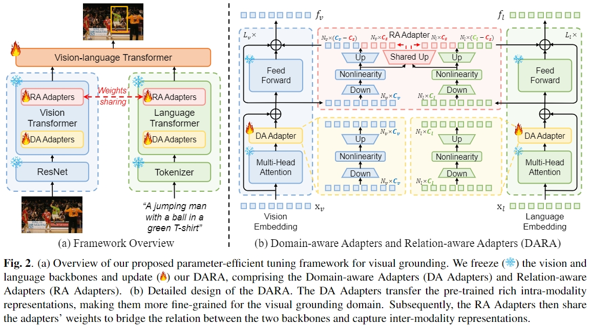

# DARA: Domain- and Relation-aware Adapters Make Parameter-efficient Tuning for Visual Grounding
Official PyTorch implementation of our paper 
* **Title**: [DARA: Domain- and Relation-aware Adapters Make Parameter-efficient Tuning for Visual Grounding](https://arxiv.org/pdf/2405.06217)
* **Authors**: [Ting Liu](https://github.com/liuting20), [Xuyang Liu](https://xuyang-liu16.github.io/), [Siteng Huang](https://kyonhuang.top/), [Honggang Chen](https://sites.google.com/view/honggangchen/), Quanjun Yin, Long Qin, [Donglin Wang](https://milab.westlake.edu.cn/), Yue Hu
* **Institutes**: National University of Defense Technology, Sichuan University and Westlake University   

## Overview

  

In this paper, we explore applying parameter-efficient transfer learning (PETL) to efficiently transfer the pre-trained vision-language knowledge to VG. Specifically, we propose **DARA**, a novel PETL method comprising **D**omain-aware **A**dapters (DA Adapters) and **R**elation-aware **A**dapters (RA Adapters) for VG. DA Adapters first transfer intra-modality representations to be more fine-grained for the VG domain. Then RA Adapters share weights to bridge the relation between two modalities, improving spatial reasoning. Empirical results on widely-used benchmarks demonstrate that DARA achieves the best accuracy while saving numerous updated parameters compared to the full fine-tuning and other PETL methods. Notably, with only **2.13%** tunable backbone parameters, DARA improves average accuracy by **0.81%** across the three benchmarks compared to the baseline model.

:pushpin: We confirm that the relevant code and implementation details will be uploaded by **June**. Please be patient.

## Contact
For any question about our paper or code, please contact [Ting Liu](mailto:liuting20@nudt.edu.cn) or [Xuyang Liu](mailto:liuxuyang@stu.scu.edu.cn).
